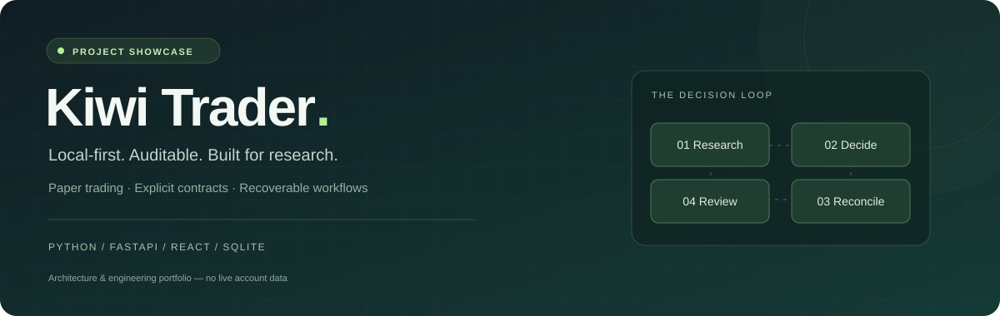

<p align="center"></p>

<p align="center"><strong>从用户问题出发，讲清产品取舍，再用可操作的原型验证。</strong></p>
<p align="center"><a href="https://dongshuangcheng.github.io/kiwi-trader-showcase/">打开交互作品集 ↗</a> · <a href="docs/product-case.md">阅读产品案例</a> · <a href="docs/privacy.md">公开范围</a></p>

## 项目是什么

**Kiwi Trader 是面向个人研究场景的模拟交易工作台。** 它尝试把建议、检查、操作和结果串成一条可以理解、可以回看的流程。

这个公开仓库以产品设计案例的视角，呈现用户场景假设、设计决策、交互原型和验证计划。不是投资服务，不展示真实账户或收益。

## 为什么做：三个需要验证的问题

| 问题假设 | 使用者可能面临的困惑 | 产品设计方向 |
| --- | --- | --- |
| 建议缺少上下文 | “为什么有这个建议？现在走到哪一步？” | 依据、阶段与下一步共同呈现 |
| 异常反馈含糊 | “是失败了，还是没有收到结果？要不要再点一次？” | 单独表达待核对状态，保留进度并解释下一步 |
| 信息仍在，但条件已经变化 | “这份内容看得见，还适合继续用吗？” | 保留信息，同时明确时效与操作限制 |

**证据边界：** 以上来自个人研究情境的设计假设，当前材料尚无正式用户访谈或规模化使用数据支持。

## 为什么这么设计

- **建议不等于行动。** 清楚表达阶段，避免使用者把分析结果理解成已执行操作。
- **异常不只是一条红色提示。** 说明发生了什么、哪些事还不确定、下一步该怎样核对。
- **旧信息不直接消失。** 保留复盘价值，同时标明它是否仍适合支持下一步。
- **先重点，再细节。** 首先回答当前状态与下一步，工程细节放在次级材料。
- **展示与隐私分开。** 用合成情境解释产品，不以真实账户数据充当展示素材。

完整的范围、取舍和反思见 [产品案例](docs/product-case.md)。

## 亲手体验

### [进入 Kiwi Trader 交互作品集 →](https://dongshuangcheng.github.io/kiwi-trader-showcase/)

| 体验 | 可以操作什么 | 对应的产品问题 |
| --- | --- | --- |
| 决策回放 | 单步、自动回放与三种情境切换 | 使用者能否理解当前阶段与下一步 |
| 异常对账 | 重复请求、补充核对依据、重置 | 含糊反馈是否会诱发重复操作 |
| 信息时效 | 拖动合成信息年龄滑块 | 能否分清可查看与适合继续使用 |
| 设计决策卡片 | 点选取舍，展开理由与验证方法 | 每个设计是否回应了明确问题 |

仅合成场景；不读取真实文件、不连接账户、不请求业务接口。适配桌面与手机。

## 怎么验证效果

**已完成**

- 关键任务的原型走查，以及桌面和手机交互检查。
- 11 项演示逻辑检查，验证重复请求、信息过期和核对等场景的反馈一致性。
- 公开文件、隐私模式和页面连接边界检查。

**待进行**

- 邀请符合场景的试用者，无提示地解释建议依据、处理待核对状态、判断过期信息。
- 观察任务完成、状态理解、重复操作与求助，并让使用者复述下一步。
- 根据实际误解调整信息层级与文案，再复测；尚无效率提升、满意度、留存或收益方面的结论。

原型运行正确，只说明流程走得通，不等于用户价值已经被证实。

## 更多材料

- [产品案例：场景、取舍、验证与反思](docs/product-case.md)
- [展示设计与参考来源](docs/design-notes.md)
- [次级工程说明](docs/engineering.md)
- [公开范围与隐私](docs/privacy.md)

核心业务实现、策略参数、账户数据、日志、凭据及原仓库历史保持私有；这里只公开作品集和独立的前端合成演示。

<details><summary>展示页维护与检查</summary>

```sh
node --test tests/demo-model.test.mjs
python3 scripts/check_public.py
```

这些检查针对公开原型，不是私有交易平台的全量验收。

</details>
