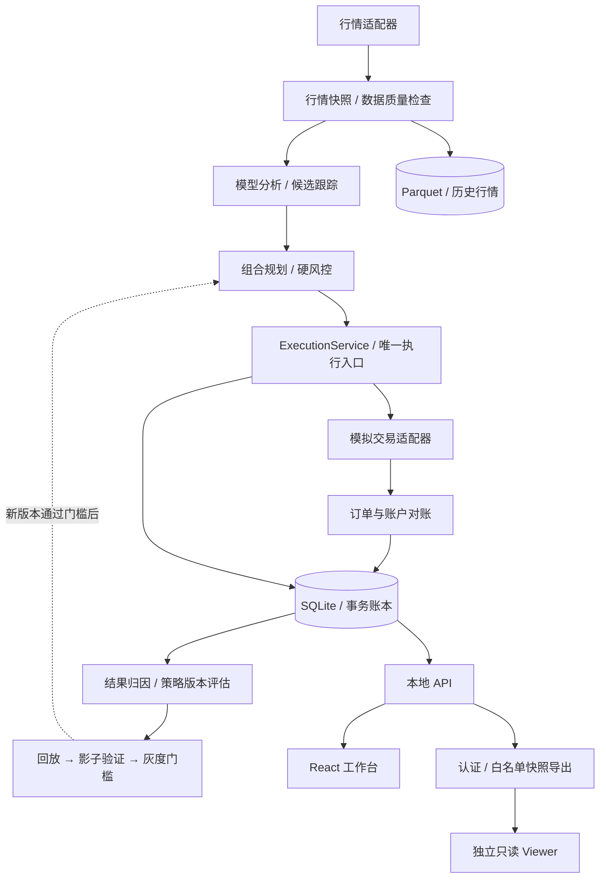

  

  <strong>让模型参与研究，让规则约束执行，让每次决策留下证据。</strong>

  Python · FastAPI · React · TypeScript · SQLite · SQLAlchemy · Alembic

  <a href="#项目概览">项目概览</a> ·
  <a href="#系统架构">系统架构</a> ·
  <a href="docs/engineering.md">工程设计</a> ·
  <a href="docs/privacy.md">公开范围</a>

## 项目概览

Kiwi Trader 是一个**本地优先的 A 股自主模拟交易研究工作台**，将行情采集、模型分析、候选跟踪、组合规划、模拟执行和结果复盘串成一条可追溯的流程。

项目重点不是让大模型直接下单，而是处理模型参与长时运行系统后出现的工程问题：数据是否过期、订单是否重复、服务重启后怎样恢复、实验结果能否回溯到当时的行情与策略。

> **这是面向作品集与简历的公开介绍仓库。** 只收录重新整理的项目说明与架构图，不含完整业务源码、运行数据或可连接真实环境的配置。项目使用模拟交易，不展示投资收益或实盘效果。

### 核心能力

| 模块 | 解决的问题 |
| --- | --- |
| 行情与候选研究 | 统一记录行情来源、周期、复权方式与时间；把模型分析与候选生命周期关联起来 |
| 决策与模拟执行 | 决策绑定行情快照和策略版本；执行入口统一校验风险与账户状态 |
| 隔离账本 | 模拟账户与不同影子实验分别记账，避免实验结果混入执行结果 |
| 复盘与策略演进 | 追踪决策后的结果，将改进沉淀为新版本，经回放、影子验证和灰度门槛推进 |
| 运行中心 | 汇总任务、告警、数据新鲜度与恢复状态，区分自动恢复和需人工处理的情况 |
| 独立只读 Viewer | 通过受限快照展示状态，与交易引擎分离；部署准备不等同于公开上线 |

## 系统架构

**关键边界：** 模型输出研究与决策建议；模拟订单由唯一执行服务提交。SQLite 是事务事实来源，JSON 仅作交换格式。Viewer 不连接交易账本或执行入口。

## 工程设计亮点

### 01 · 网络超时，不等于订单失败

在远程请求前持久化订单意图，以唯一标识约束重复提交。遇到超时或含糊响应时保留 `unknown` 状态，先对账再决定后续动作，避免简单重试造成重复订单。

### 02 · 数据“有值”和“可用于决策”分开判断

行情保留来源、周期、复权方式、快照时间与质量状态。缺失保留缺失，历史补采不伪装成实时数据；同一决策绑定确定的行情快照和策略版本，便于回放与追溯。

### 03 · 金额精度与时间语义进入存储合同

工作区实现了固定精度整数存储、业务层 `Decimal`、接口十进制字符串，以及显式时区约定。迁移包含预检查、溢出防护与事务回滚测试；**实现和离线测试不等同于已完成运行库迁移**。

### 04 · 长时运行围绕恢复能力设计

用任务租约与执行权校验限制重复执行；将休眠、断网、重启和未决订单纳入恢复流程。告警根据后续成功事实与审计证据闭环，而非只清除界面提示。

### 05 · 实验与执行保持隔离

影子实验采用独立账本。策略调整生成新版本，经过回放、影子验证和灰度门槛，保留原决策与持仓的版本归属，避免用后来的信息改写历史。

更多取舍见 [工程设计说明](docs/engineering.md)。

## 技术栈

| 层次 | 主要技术 |
| --- | --- |
| 后端与接口 | Python 3.12、FastAPI、Pydantic、HTTPX |
| 前端 | React、TypeScript、Vite、Lightweight Charts |
| 数据与迁移 | SQLite、SQLAlchemy、Alembic、Parquet、DuckDB |
| 调度与运行 | APScheduler、任务租约、系统凭据库 |
| 工程与测试 | uv、pytest、Ruff、Vitest、Playwright |

## 验证思路

围绕失败场景建立离线测试，而非只验证正常请求：

- **幂等性：** 同一决策重复请求时只提交一次模拟订单。
- **不确定响应：** 远程结果含糊时保留待对账状态，不盲目重发。
- **一致性：** 账户、成交与订单状态有明确归属及对账规则。
- **数据合同：** 检查精度、单位、时区、新鲜度及迁移原子性。
- **边界隔离：** 只读 Viewer 与数据库、交易运行时依赖分离。
- **回放约束：** 区分事件发生时间与信息已知时间，约束未来信息泄漏。

以上为项目测试关注点，不代表公开仓库包含完整测试套件，也不构成全量测试通过、生产部署或策略有效性的声明。

## 展示范围

- 本仓库：项目概览、架构图、工程取舍与隐私边界。
- 保留在私有环境：业务实现、策略参数、提示词、测试明细、运行记录和部署配置。
- 不公开：账户与持仓、订单与成交、资金与收益、凭据、私有地址、本机路径及原仓库历史。

此仓库不是交易服务，也不提供安装包或运行入口。详见 [公开范围与隐私说明](docs/privacy.md)。
