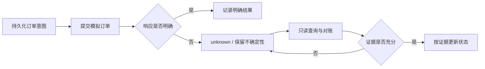

# 工程设计说明

[返回项目首页](../README.md)

这份说明聚焦实现中的工程取舍，不披露策略、运行数据或部署细节。架构是概念级摘要，而非完整调用关系或数据库结构。

## 1. 把模型建议与执行权限分开

模型适合分析候选、组织研究信息与提出组合建议，但输出仍可能受超时、格式错误和行情变化影响。系统将模型分析、组合规划、硬风控与执行入口分层处理。

- 研究代理输出观察、候选或建议。
- 决策关联行情快照与策略版本。
- 执行服务统一检查账户、数据质量与风险条件。
- 模拟交易适配器只由唯一执行入口调用。

**取舍：** 接受更多显式状态与检查步骤，换取执行边界清楚、失败位置可追踪。

## 2. 用持久化意图处理不确定响应

请求超时可能发生在远端已接收订单之后。因此，“本地没有收到成功响应”与“远端没有创建订单”是两个不同事实。

唯一键与事务控制本地重复请求；远端结果则通过账户与订单证据核对。两者组合用于降低重复提交风险，不把它表述为跨系统“绝对 exactly-once”。

**取舍：** 在结果不确定时优先保留真实状态，牺牲部分即时可用性，避免用重试掩盖一致性问题。

## 3. 将数据语义作为接口的一部分

一个价格不仅有数值，还包含单位、周期、来源、复权方式和时点。缺少这些语义，即使请求成功，结果也可能不适合决策。

系统分别处理：

- **事务真值：** SQLite 保存运行状态与事件账本。
- **历史数据：** Parquet 支持历史行情存储与分析。
- **交换数据：** JSON 用于受限导入导出，不取代账本。
- **精确数值：** 固定精度整数存储在边界转换为业务单位；接口保留十进制字符串。
- **时间：** 明确市场时间、UTC 与事件在当时是否已知，避免隐含时区或回放穿越。

固定精度存储涉及数据库迁移；代码与迁移测试已在工作区实现，实际运行库状态应以独立迁移验收为准。

**取舍：** 增加边界转换与合同测试，以减少浮点误差、单位混淆和历史数据被误当作实时数据的问题。

## 4. 将故障恢复变成系统流程

本地常驻程序会遇到休眠、断网、重启和存储暂时不可用。恢复流程不仅要重启任务，还要重新确认任务归属与未决订单。

- 任务租约和执行权校验限制并发重复执行。
- 对可分类的瞬时故障实施有界重试。
- 未知订单优先对账，历史数据缺口继续标记为缺口。
- 运行界面区分系统自动恢复与需要人工处理的事项。
- 告警闭环保留原失败及后续恢复证据。

**取舍：** 状态机更复杂，但故障行为更容易定位、测试和解释。

## 5. 远程查看与本地交易解耦

独立 Viewer 采用“本地服务 → 认证与白名单快照 → 单向传输 → 只读展示”的结构。它不直接打开交易数据库，也不持有下单能力。

“只读”不代表数据适合公开：账户快照仍可能包含私密信息。这个公开展示仓库与 Viewer 完全分开，没有运行数据接口或账户入口。

**状态边界：** Viewer 的实现、模板与离线验证不代表已在公网部署。本作品集仅发布静态项目说明。

## 6. 如何描述验证结果

项目设置了订单幂等、不确定响应、账本隔离、恢复状态、迁移回滚、数据新鲜度和回放时间约束等测试场景。

这些场景分别回答不同问题：单项测试通过不代表全量回归完成，全量回归不代表长时间运行验收完成，工程可靠性也不等同于策略盈利能力。公开页面不使用未经独立证据支持的收益率、性能指标或可用性数字。
